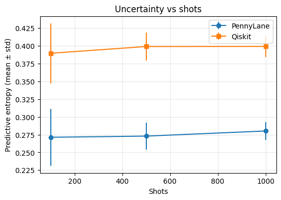

QuantumUQ
=========


[](https://pypi.org/project/quantumuq/)
[](https://pypi.org/project/quantumuq/)
[](https://github.com/ocatak/QuantumUQ/actions/workflows/ci.yml)
[](https://quantumuq.readthedocs.io/en/latest/)
[](https://doi.org/10.36227/techrxiv.177205048.88644983/v1)
[](LICENSE)
[](https://pypi.org/project/quantumuq/)

> **QuantumUQ -- Uncertainty Quantification for Quantum Machine Learning**
>
> Measure shot noise, epistemic uncertainty, calibration, and noise
> sensitivity in **PennyLane** and **Qiskit** models.
>
> ```bash
> pip install quantumuq
> ```

Measured identically across both backends via the same `Predictor`
interface: as shot count increases, the *variability* of the predictive
entropy estimate across repeated measurements narrows (smaller error bars),
even though the mean entropy for this fixed, already-trained model stays
roughly constant. More shots make each measurement of the model's
uncertainty more precise -- they do not, by themselves, change how uncertain
the model actually is.



### Installation

```bash
pip install quantumuq
# With optional Qiskit Aer support:
pip install "quantumuq[aer]"
```

### Quick examples

PennyLane:

```python
from quantumuq import wrap_qnode, ShotBootstrap
import pennylane as qml
import numpy as np

dev = qml.device("default.qubit", wires=2, shots=1000)

@qml.qnode(dev)
def circuit(x, params):
    qml.AngleEmbedding(x, wires=[0, 1])
    qml.StronglyEntanglingLayers(params, wires=[0, 1])
    return qml.probs(wires=[0, 1])

# 2 qubits -> 4 outcomes (|00>,|01>,|10>,|11>); collapse to 2 classes.
def probs_4_to_2(p):
    p = np.asarray(p)
    if p.ndim == 1:
        return np.array([p[0] + p[1], p[2] + p[3]])
    return np.stack([p[:, 0] + p[:, 1], p[:, 2] + p[:, 3]], axis=-1)

params = 0.1 * np.random.default_rng(0).standard_normal((1, 2, 3))
predictor = wrap_qnode(
    circuit, task="classification", n_classes=2, params=params, postprocess=probs_4_to_2
)
uq = ShotBootstrap(n_samples=16, shots=1000, seed=0)
uq_model = predictor.with_uq(uq)
dist = uq_model.predict_dist(np.random.randn(4, 2))
print(dist.mean.shape, dist.std.shape)
```

Qiskit:

```python
from quantumuq import wrap_qiskit_sampler, ShotBootstrap
from qiskit.circuit import Parameter, QuantumCircuit
from qiskit.primitives import StatevectorSampler
import numpy as np

theta = Parameter("theta")
qc = QuantumCircuit(1)
qc.ry(theta, 0)
qc.measure_all()

def feature_map(X: np.ndarray):
    return [[float(x[0])] for x in np.atleast_2d(X)]

# A Generator instance (not a plain int) makes the sampler's RNG state
# advance across calls, so repeated ShotBootstrap draws actually differ.
sampler = StatevectorSampler(seed=np.random.default_rng(0))
predictor = wrap_qiskit_sampler(
    sampler,
    circuit=qc,
    task="classification",
    n_classes=2,
    feature_map=feature_map,
)
uq = ShotBootstrap(n_samples=8, shots=1000, seed=0)
uq_model = predictor.with_uq(uq)
dist = uq_model.predict_dist(np.random.randn(4, 1))
print(dist.mean.shape, dist.std.shape)
```

### Methods & metrics

- **Uncertainty methods**: `ShotBootstrap`, `DeepEnsemble`, `NoiseProfile`
- **Metrics (classification)**: `nll`, `brier`, `ece`, `predictive_entropy`
- **Metrics (regression)**: `rmse`, `gaussian_nll`
- **Persistence**: `UQModel.save()` / `UQModel.load()` checkpoint a fitted
  model's trained parameters and method config for both PennyLane and Qiskit
  predictors

### Benchmark suite

`quantumuq.benchmarks` trains a small reference variational classifier and
sweeps shot count, reporting accuracy and calibration metrics
reproducibly -- so a paper can cite a fixed benchmark rather than "we used
a Python package."

```bash
pip install "quantumuq[benchmarks]"  # adds scikit-learn, for iris/breast_cancer
quantumuq-benchmark --backend pennylane --dataset moons --shots 100,500,1000,10000
```

- **Datasets**: `moons` (no extra dependency), `iris` (binary subset),
  `breast_cancer` -- all reduced to 2 features so the same small reference
  circuit applies to each; `iris`/`breast_cancer` require scikit-learn.
- **Backends**: `pennylane` (gradient-trained) and `qiskit` (SPSA-trained,
  since Qiskit circuits aren't differentiable through this library).
- **Metrics per shot count**: accuracy, `nll`, `ece`, `brier`,
  `predictive_entropy`, and mean `ShotBootstrap` uncertainty.
- `--output results.csv` saves the full table. The same functionality is
  available from Python via `quantumuq.benchmarks.run_benchmark(...)`.

This is a lightweight harness, not a rigorous ML pipeline -- see
`quantumuq.benchmarks.run_benchmark`'s docstring for the exact
simplifications (fixed single train/test split, dataset subsampling for
consistent runtime, a shared 2-feature/2-qubit circuit architecture).
Quantum kernel classifiers and hybrid QNN models, and depolarizing/readout
noise sweeps, are natural extensions not yet implemented.

### Examples

Runnable notebooks live in
[`examples/notebooks/`](https://github.com/ocatak/QuantumUQ/tree/main/examples/notebooks):

- [`00_pennylane_quickstart.ipynb`](https://github.com/ocatak/QuantumUQ/blob/main/examples/notebooks/00_pennylane_quickstart.ipynb) -- classification with `ShotBootstrap` on PennyLane
- [`01_qiskit_quickstart.ipynb`](https://github.com/ocatak/QuantumUQ/blob/main/examples/notebooks/01_qiskit_quickstart.ipynb) -- classification with `ShotBootstrap` and `NoiseProfile` on Qiskit
- [`02_pennylane_training_ensemble.ipynb`](https://github.com/ocatak/QuantumUQ/blob/main/examples/notebooks/02_pennylane_training_ensemble.ipynb) -- `DeepEnsemble` over trained PennyLane models
- [`03_qiskit_training_spsa.ipynb`](https://github.com/ocatak/QuantumUQ/blob/main/examples/notebooks/03_qiskit_training_spsa.ipynb) -- training a Qiskit circuit with SPSA
- [`04_shots_sweep_noise_profile.ipynb`](https://github.com/ocatak/QuantumUQ/blob/main/examples/notebooks/04_shots_sweep_noise_profile.ipynb) -- `NoiseProfile` shot sweeps
- [`05_ece_calibration_bugfix.ipynb`](https://github.com/ocatak/QuantumUQ/blob/main/examples/notebooks/05_ece_calibration_bugfix.ipynb) -- calibration with `ece()`, including the confidence=1.0 edge case
- [`06_uqmodel_persistence.ipynb`](https://github.com/ocatak/QuantumUQ/blob/main/examples/notebooks/06_uqmodel_persistence.ipynb) -- `UQModel.save()`/`load()` checkpointing
- [`07_qiskit_v2_primitives.ipynb`](https://github.com/ocatak/QuantumUQ/blob/main/examples/notebooks/07_qiskit_v2_primitives.ipynb) -- `BaseSamplerV2`/`BaseEstimatorV2` usage and seeding gotchas
- [`08_pennylane_community_demo.ipynb`](https://github.com/ocatak/QuantumUQ/blob/main/examples/notebooks/08_pennylane_community_demo.ipynb) -- "How Confident Should You Be in a Quantum Classifier?", a PennyLane Community Demo

### Roadmap

- Richer model adapters (more flexible outputs, calibration hooks)
- Additional metrics and visualization utilities
- Optional integrations with experiment tracking tools
- Benchmark suite: quantum kernel classifiers and hybrid QNN models,
  depolarizing/readout noise sweeps (currently shot-count only)

### License

MIT License. See `LICENSE` for details.

### Code of Conduct

This project adheres to the Qiskit Code of Conduct. See `CODE_OF_CONDUCT.md`.

### Citation

If you use QuantumUQ in academic work, please cite (also available via
GitHub's "Cite this repository" button, backed by `CITATION.cff`):

```bibtex
@article{Catak_2026,
  title={QuantumUQ: A Library for Uncertainty Quantification in Quantum Machine Learning},
  url={http://dx.doi.org/10.36227/techrxiv.177205048.88644983/v1},
  DOI={10.36227/techrxiv.177205048.88644983/v1},
  publisher={Institute of Electrical and Electronics Engineers (IEEE)},
  author={Catak, Ferhat Ozgur},
  year={2026},
  month=feb 
}

```

