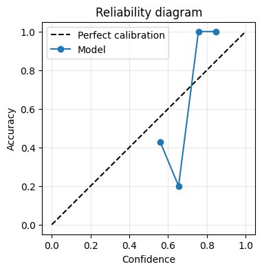
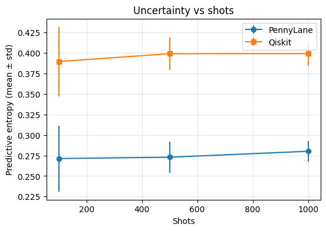

# Summary

Quantum machine learning models can produce predictions that look confident even when they are unreliable. This can happen because quantum computers estimate outputs by sampling measurements (“shots”), because near-term devices are noisy, and because training quantum models can be unstable. **QuantumUQ** is an open-source Python library that helps researchers measure and compare predictive uncertainty in quantum machine learning workflows across two widely used ecosystems: **PennyLane** and **Qiskit**.

QuantumUQ provides tools to estimate shot-based variability, approximate model (epistemic) uncertainty using ensembles, profile prediction stability across different shot budgets, and evaluate reliability using calibration metrics such as reliability diagrams and expected calibration error (ECE). The library targets researchers who need reproducible, backend-agnostic uncertainty analysis for variational quantum classifiers and related QML models.

# Statement of need

Uncertainty quantification (UQ) is a key element of trustworthy machine learning because it helps detect when a model’s output should not be trusted. In quantum machine learning (QML), uncertainty has additional sources that are intrinsic to quantum computation: measurement outcomes are stochastic and expectation values are estimated with a finite number of shots, leading to sampling variance that depends directly on the measurement budget [@nielsen2010quantum]. Furthermore, NISQ-era devices introduce hardware noise that perturbs measurement statistics [@preskill2018quantum]. Variational quantum circuits can also be difficult to train due to non-convex optimization and barren plateaus [@mcclean2018barren], and uncertainty-aware approaches are increasingly important for reliable evaluation [@2017arXiv170304977K].

While QML frameworks provide powerful tools to construct and train circuits, they do not provide a unified, research-focused interface for uncertainty estimation, shot-budget profiling, and calibration analysis across backends. As a result, QML studies often report accuracy without systematically characterizing reliability. QuantumUQ fills this gap by providing a backend-agnostic UQ layer aimed at QML researchers who need consistent uncertainty metrics, reproducible experiments, and explicit resource–reliability trade-off analysis.

# State of the field

PennyLane and Qiskit support circuit construction, simulators/hardware execution, and variational training. However, uncertainty-related evaluations are typically implemented ad hoc and are not standardized across frameworks. Classical uncertainty libraries and calibration toolkits are widely used in conventional deep learning, but they do not model shot-driven uncertainty or measurement-budget trade-offs in QML. Calibration for probabilistic classifiers is well studied in classical ML [@10.5555/3305381.3305518], yet QML papers rarely include systematic calibration diagnostics.

QuantumUQ contributes a QML-specific layer that standardizes shot-based uncertainty estimation, ensemble-based epistemic uncertainty [@lakshminarayanan2017simple], stability profiling across shot budgets, and calibration metrics. It also provides adapters that make these evaluations consistent across PennyLane and Qiskit. This design enables reproducible research and fair comparisons across backends.

# Software design

QuantumUQ is organized around (i) backend adapters, (ii) uncertainty methods, (iii) a predictive distribution representation, and (iv) evaluation metrics.

Backend adapters normalize execution across PennyLane and Qiskit, enabling repeated circuit evaluations at specified shot budgets. A `PredictiveDistribution` abstraction represents repeated stochastic predictions and exposes common uncertainty summaries (mean, variance) and reliability metrics (entropy and calibration).

QuantumUQ implements two core uncertainty estimators: shot-based estimators that quantify measurement-induced variability, and ensemble-based estimators that approximate epistemic uncertainty by training multiple independent models [@lakshminarayanan2017simple]. The library also includes stability profiling utilities that characterize how predictions change as shot count increases, supporting principled selection of measurement budgets.

Design trade-offs are explicit: higher shot counts reduce sampling variance but increase runtime, while ensemble methods increase cost linearly in the number of trained models. QuantumUQ makes these trade-offs measurable and reproducible for QML workflows.

## Example Outputs

QuantumUQ includes utilities for calibration analysis and measurement-budget profiling. 
\autoref{fig-reliability} shows a reliability diagram generated using the library, 
illustrating mild overconfidence in high-confidence regions. 
\autoref{fig-shots} shows predictive entropy as a function of the number of measurement shots for both PennyLane and Qiskit backends, demonstrating the expected decrease in uncertainty as the shot budget increases.

{#fig-reliability width="100%"}

{#fig-shots width="100%"}

# Research impact statement

QuantumUQ is distributed as an installable Python package and includes documentation and executable notebooks demonstrating usage with both PennyLane and Qiskit. The repository provides reproducible materials for generating calibration plots and uncertainty-versus-shots curves for variational quantum classifiers [@PhysRevA.101.032308]. The package supports research questions central to reliability in QML: how many shots are required for stable predictions, where models are overconfident, and how uncertainty behavior differs across backends.

The software is designed to support near-term research impact by enabling consistent evaluation across QML frameworks and by providing reusable, reproducible building blocks for trustworthy quantum machine learning experiments.

# AI usage disclosure

- Generative AI tools were used to assist with drafting and editing parts of the manuscript and/or documentation. All AI-assisted content was reviewed and edited by the author, and correctness was verified via unit tests and rerunning the provided notebooks end-to-end.

# Acknowledgements

(Add funding, institutional support, compute resources, or project acknowledgements here.)

# References
